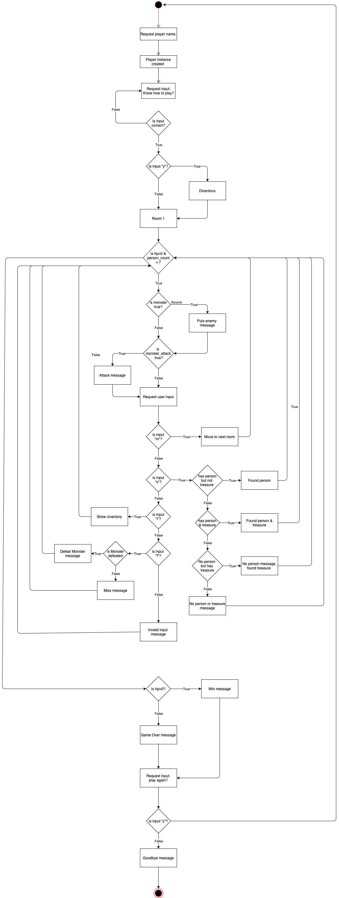
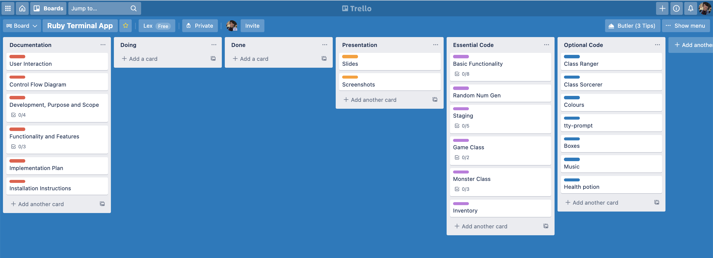

# A Knoll of Gnolls 

###### Aleksandra Zaskalkina

**Repository:** [link](https://github.com/Lex-KZ/KnollofGnolls)

## Development, Purpose and Scope

### Description

A Knoll of Gnolls (KoG) is an interactive, text-based, RPG adventure, set in a high fantasy world and based on Dungeons and Dragons 5th edition mechanics. The user will play their way through a series of randomly generated rooms, looking for missing people and treasure, and fighting a ferocious pack of Gnolls, which are humanoid hyena like creatures. At the end of the game they will be given how much experience points (exp) they have gained, as well all the treasure and items the player has found. 

### Problem

Many high fantasy-based RPGs are heavily focused on high-definition graphics rather than interaction with the players environment. KoG seeks to re-focus on that element of gameplay. KoG is meant to be a short, relaxing and entertaining adventure.

### Target Audience

The target audience of KoG are those that have a solid grasp on how to use the terminal and have an interest in RPGs in a fantasy setting. Due to KoG being a terminal app, the user would need to know how to use the terminal. The game also relies on fantasy tropes in many of the choices that it presents to the user, and it would there for be useful for the user to have a passing familiarity with the genre.

### Target Audience Usage

The audience is to use this as entertainment. The users are to access the application through their operating system’s terminal client. 

## Features
- **Probability Based Gameplay:** The game mechanics of KoG are based of “dice rolls”. The different events, such as monster attacks, finding treasure and the missing citizens, all have a different chance of happening. This varies the game’s length and makes the player pay attention to the game so as that they do not die and lose the game.
- **Inventory:** As the user makes their way through the story and locations, they will encounter items and treasures. In the plot of the game, the player character is being paid for their expedition into the caverns, but it never hurts to find a little more.
- **Score Record:** The gameplay relies on user input to progress. The user is presented with a room and potentially a combat situation and is prompted for input. The input is then evaluated and executed, which then progresses the turn based game.

## Gems
- Terminal-Table
- Colorize
- RSpec
- tty-prompt

## User Interaction & User Experience

### How the user will find out how to interact with each feature
The user is asked early in the game if they know how to play. If they answer no, they will be presented with the message "To play, type one of the given commands.". At every in game prompt the options (m - move, s - search, i - inventory, and f - fight), are listed following the prompt. 

### How the user will interact with each feature
The user should follow the instructions in the prompt. The first prompt they will encounter will be one where they enter their name and they should do so. Following that the player will be asked if they know how to play. The player should indicate if they do or not. 

Once the player is in the first room the player will be asked the same prompt over and over until they meet the exit condition. The player should indicate if they want to search, move, look at their inventory or fight. 

Finally, the user will be asked if they want to play again. They should indicate if they do or do not. If they indicate yes, the game will restart. If they indicate no, the game will end with a goodbye message. 

### How errors will be handled and displayed to the user
Errors will only arise from incorrect input. When prompted for their name, the player cannot progress if the name value is nil. They will instead be told that they must input a name to progress and ask them again. When asked if they no how to play and when they ask if they want to play again, and they input something other than "y" or "n" they will be told that those are the only valid inputs and prompted again. Finally, at the game prompt, if the user inputs something other than the listed options, the user will be informed that they must input one of the given options. 

## Control Flow Diagram 

## Implementation Plan

Trello board initially:

Implementation began with this documentation. The documentation is intended to be done by Monday 5th of April. Coding will begin with pseudo code. from there it will go to the Essential Code list. from there, if there is time before submission I will go onto the Optional Code list. 

## Instructions
These instructions assume that ruby is already installed on your device.
1. Open a terminal
2. Create or navigate to the directory in which you will save "The Knoll of Gnolls"
3. Run to clone repository:
~~~ 
git clone git@github.com/Lex-KZ/KnollofGnolls 
~~~

4. Open the Gemfile and instal the gems listed through bundle

5. To start the game, run:
~~~
 $ ruby knoll_of_gnolls.rb 
 ~~~

